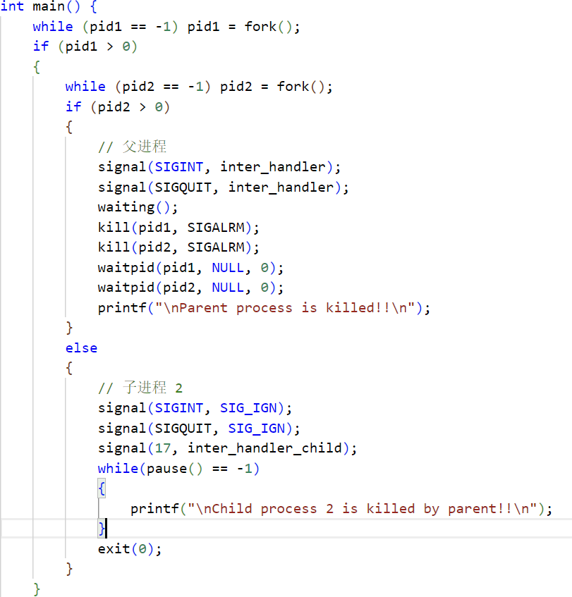

此openEuler版本的delete和quit(SIGINT和SIGQUIT)数字为2，3.

如何做到输入ctrl C后只终止子进程1，为什么此时父亲进程也会被终止？

如下图1：为什么在if判断存在的情况下，kill会被直接执行？

解决：signal函数只是设置信号处理方式，与具体的用户键盘操作无关。

如何在5s内键入“C”使得1结束，键入“\”使得2结束，互不干扰？

为什么先C再\或者先\再C会导致父进程直接结束？

在如下的程序中在父进程中捕获SIGINT和SIGQUIT会导致inter_handler_child函数在键入一个C或者\就执行两次，导致父进程wait结束。

原因：ctrl C/\会给当前的所有信号发送SIGINT/SIGQUIT信号，导致两次执行。

如下程序：超出5秒不会自行结束。忘记发送SIGALRM信号，本来想使用alarm函数，后来认为不太容易实现，因为alarm总会计时5秒，灵活性不足。此处的waiting函数也存在bug，会导致直接退出。

理解错误，认为C结束1，\结束2。

但其实这样或许更好的完成了任务（？
 
使用while（pause() == -1){}
来捕获来自键盘的SIGINT SIGQUIT信号并做相应的进程退出操作。

多次运行结果如下：

5秒后自行中断结果如下：

管道通信：
关于lockf函数：cmd参数：
F_LOCK:1，获得锁，若已被锁，则阻塞等待
F_TLOCK:2：尝试获得独占锁，若文件已经锁，则返回错误。
F_ULOCK:0：释放锁
F_TEST:3：测试能否获取锁，能返回0，不能返回-1。

write函数：
ssize_t write(int fd, const void *buf, size_t count);
fd:文件描述
buf:缓冲区
count:字节数

read函数：
ssize_t read(int fd, void *buf, size_t count);
返回成功读到的数据大小

在父进程为以下内容时，程序会卡死：

修改后不会卡死：

分析原因:

如下图：不加锁的pipe写入程序，但是输出结果与加锁的效果相同。

结果如图：

分析原因：可能是子进程2的创建时间太晚，修改思路：1，2子进程同时创建。
修改为如下形式：

修改后输出依然没有变化。
分析原因：可能是因为输入的数据量过小，两个进程还没来得及进行并发写入，进程1的写入就已经完成。所以没出现我认为的乱序结果。

